# LieDetectorGameV2

Il progetto consiste nello sviluppo di un'app Android per la raccolta dati di video etichettati come verità/bugia.

Nello specifico è stato sviluppato un gioco a coppie in cui due giocatori si sfidano su chi è più bravo ad ingannare l'altro e, nello sfidarsi, devono registrare dei video con il loro smartphone.

Oltre a tutto il meccanismo del gioco (compreso di sistema di report, leaderboard, ...) sono state implementate anche tutte le attività di contorno per una messa in produzione dell'applicazione, in modo da rendere utilizzabile l'app al 100%, tra cui:
- rilascio di tutta l'infrastruttura su server dell'università
- creazione di script di esportazione del database in modo da creare un dataset di video con relative label
- creazione di una dashboard amministratore in React (utilizzabile solo dai professori / assistenti) per poter gestire tutte le informazioni dell'applicazione, utenti, partite, ...

Qui di seguito si possono vedere alcuni screenshot dell'applicazione Android.

## Login

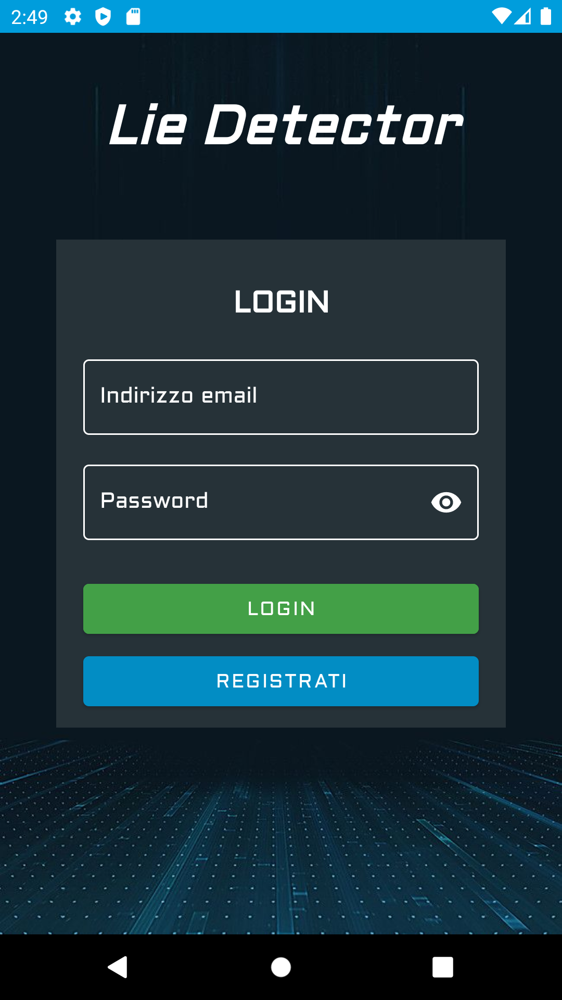

## Invito Giocatori

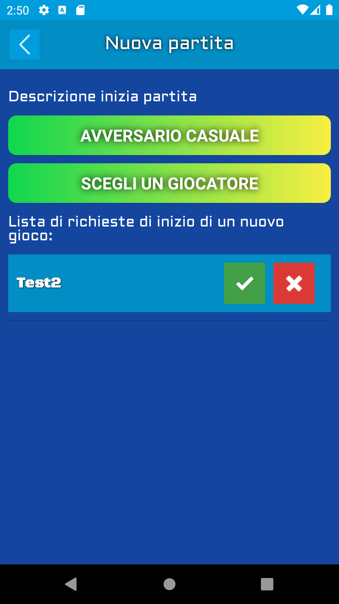

## Home

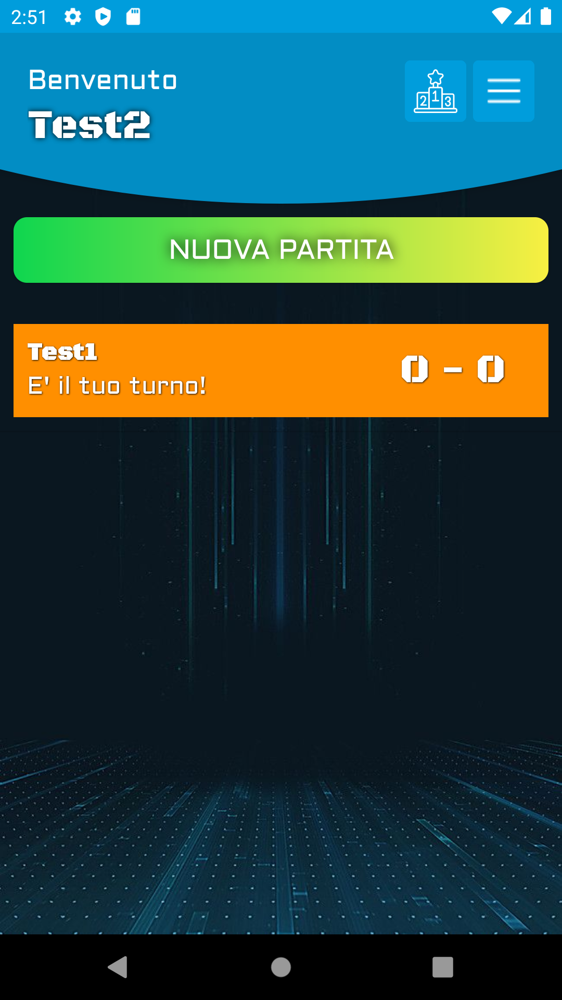

## Schermata Gioco

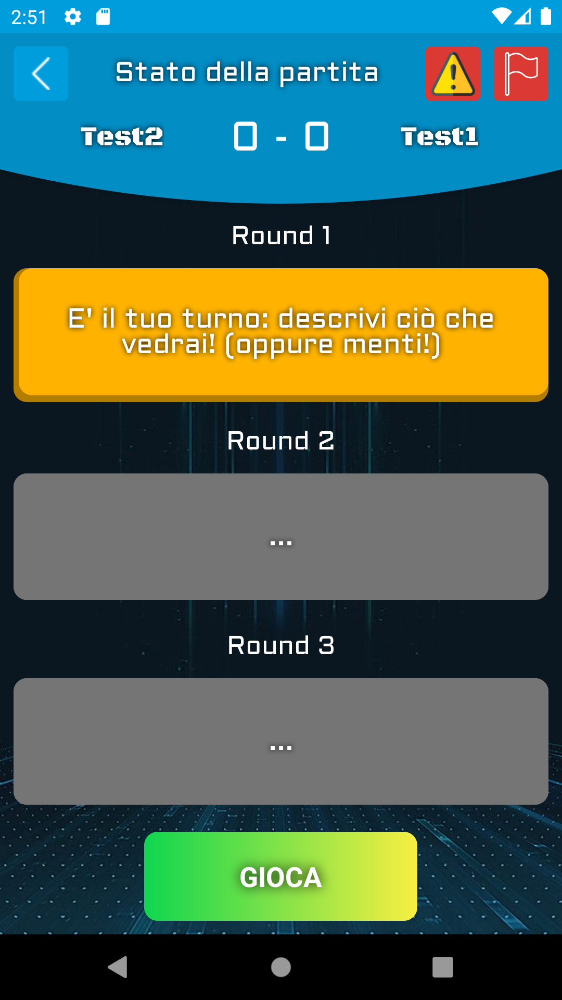

## Inviare Video

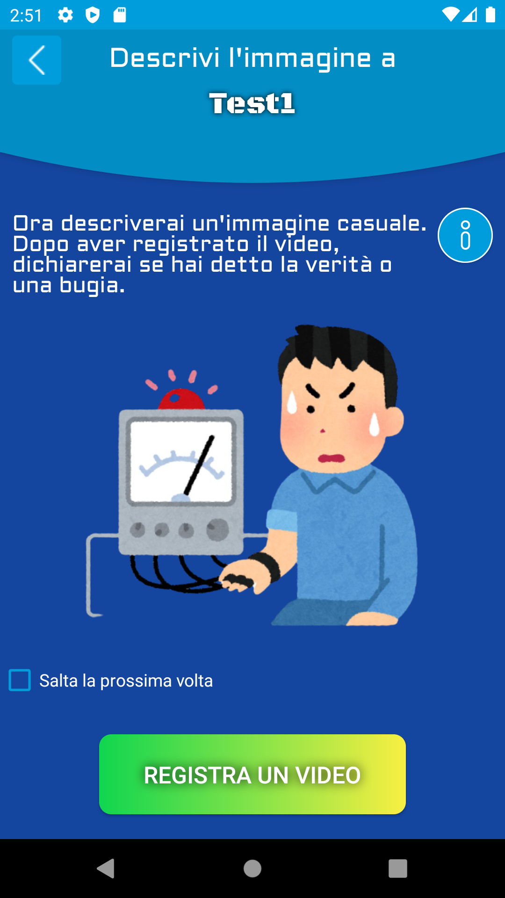
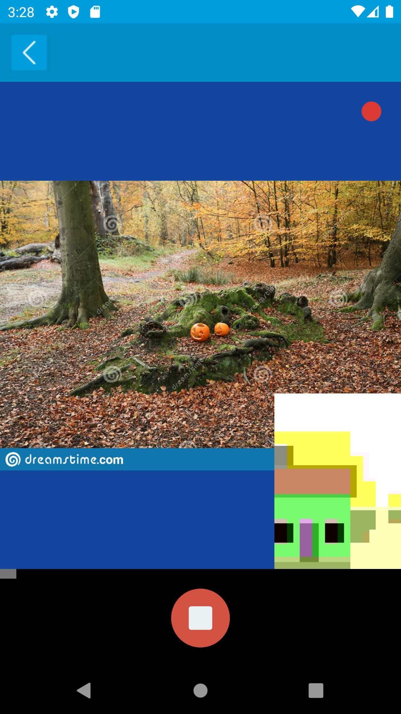
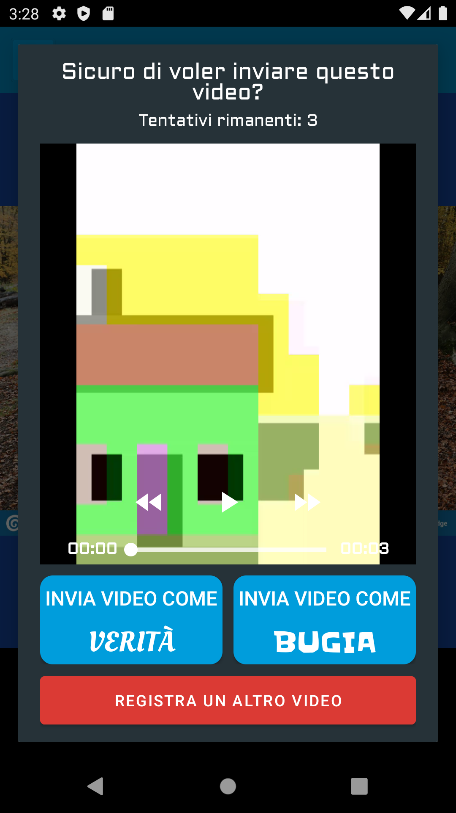

## Valutazione Video avversario

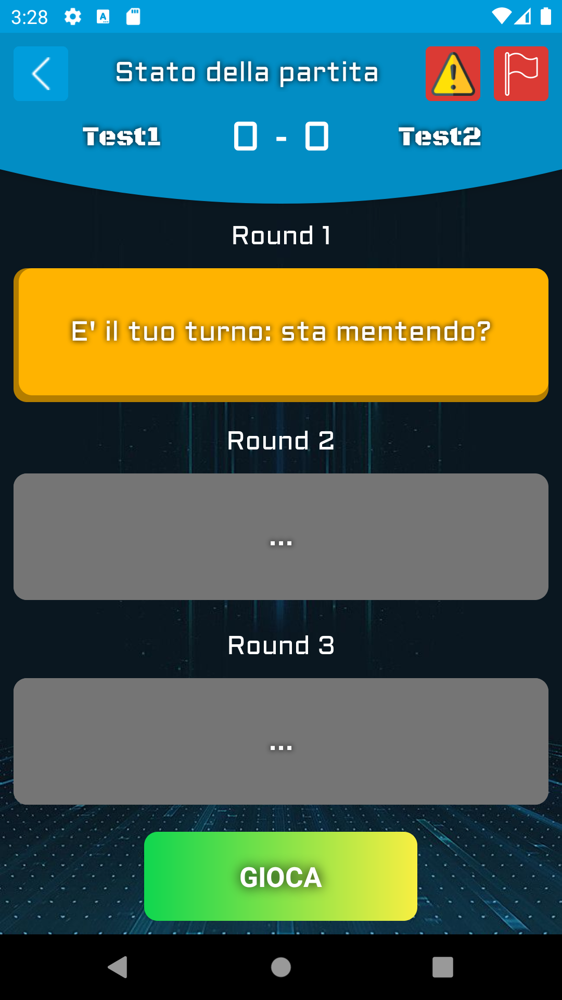

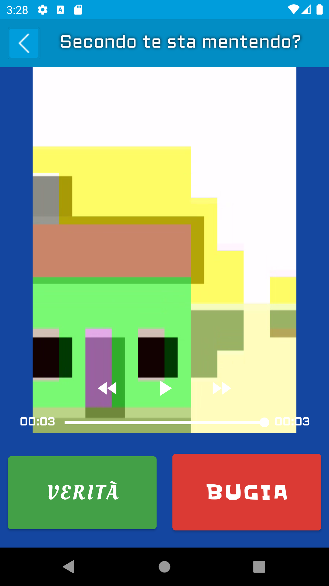

## Fine Gioco

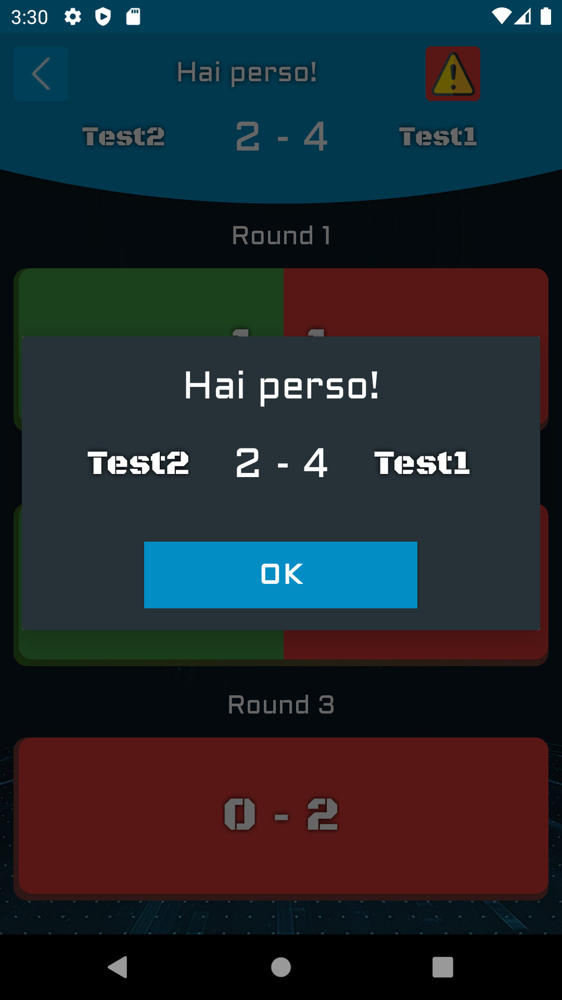
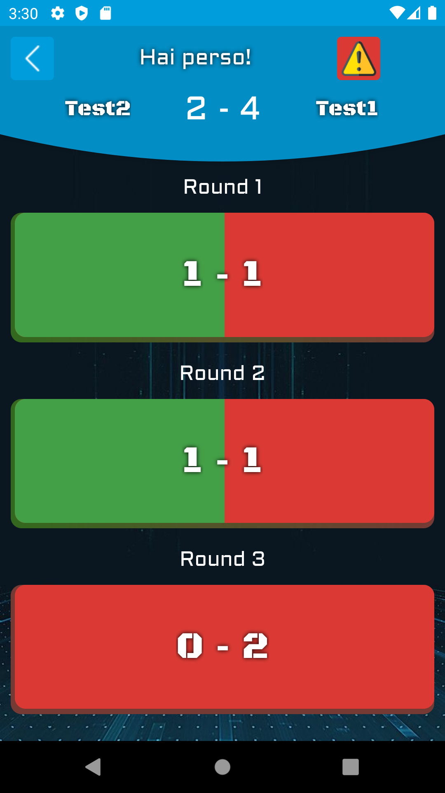
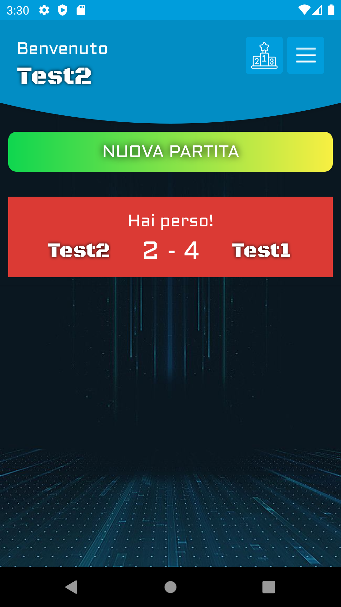

## Leaderboard

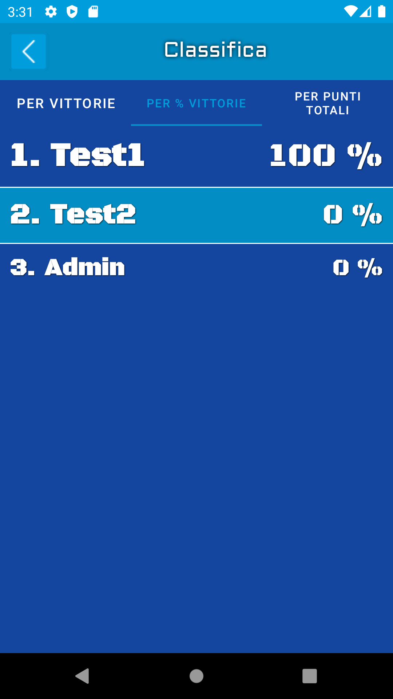

## Impostazioni

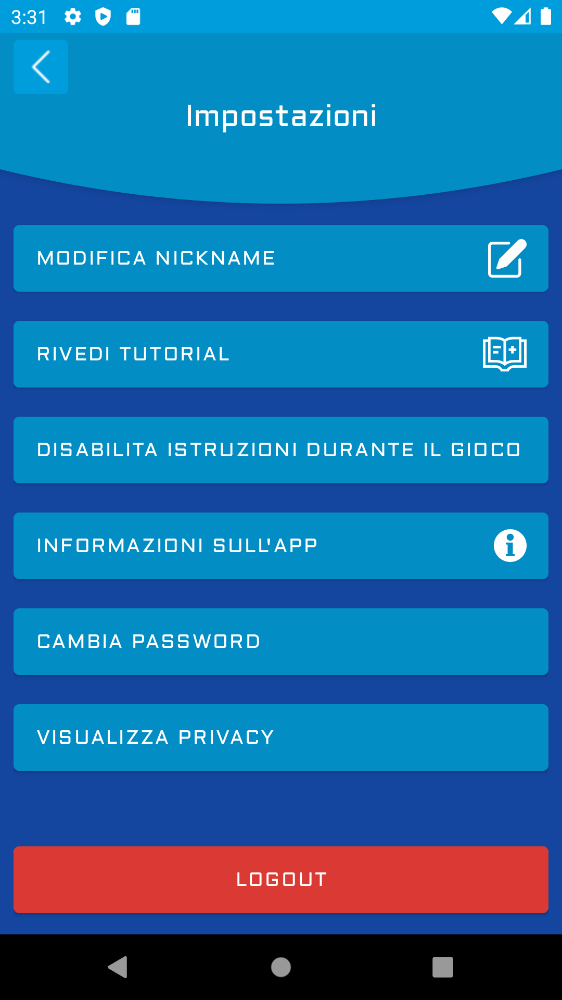